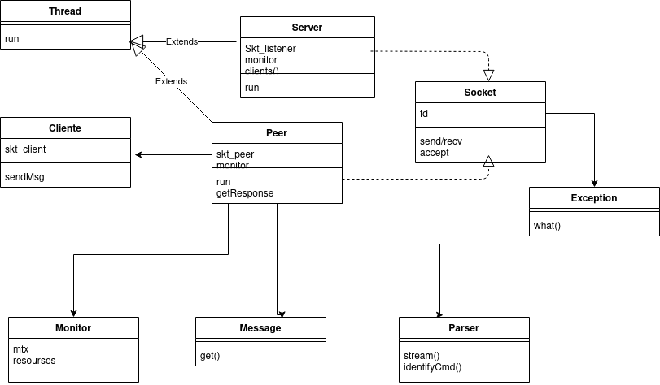
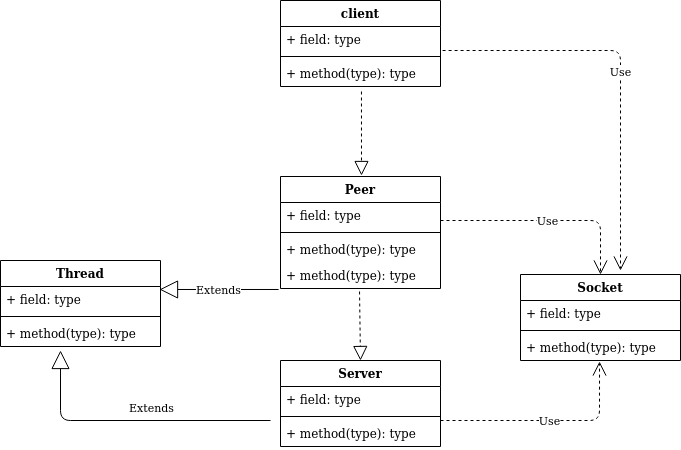
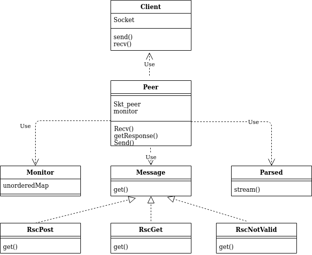

# Taller de programación I 7542

### Nombre y apellido: Lucía Pardo

### Padrón: 99999

### Repositorio: https://github.com/luciaPardo/tp3

### 2do cuatrimestre de 2020

 
 

# TallerPages

## Introducción: 
En el presente trabajo práctico se implementarán petitorios HTTP con un servidor y múltiples clientes dando de alta a recursos del mismo. 

## Modelo

Se comenzó tratando de implementar el cliente-servidor realizado para el TP1 pero trasladado a muchos clientes. Para esto fue necesario crear una clase intermediaria entre cliente y servidor, que heredara de Thread para que cada vez que el servidor aceptara un cliente, se lanzara un peer que manejara la comunicación entre el hilo aceptador(servidor) y el cliente que manda el mensaje. Una vez logrado los canales de comunicación, se pasó a implementar las clases para poder parsear los mensajes y generar las respectivas respuestas. Para almacenar los mensajes se creó un objeto compartido que se encargara de asegurarse que no se generaran race conditions.
A continuación se presenta un diagrama de clases en su conjunto (se obviaron algunas clases para mayor claridad).

 
 

 

Se presentan por separado un diagrama que muestra las clases que interconecta el servidor, el cual lanza una clase Peer y a su vez recibe un cliente. Tanto Peer como Server heredan de Thread ya que funcionan como hilo. El server (hilo aceptador) que es lanzado desde el main,  escucha por conexiones entrantes y acepta a medida que se van encolando los clientes, lanzando hilos de la clase Peer, que funciona como mediador.

 
 

 

Además se representa la relación de Peer con el Parseo del mensaje recibido por el cliente y como el parseador lo guarda en la clase Monitor, la cual funciona como objeto compartido y almacena el recurso con su body asociado en un hash. Se utilizó un hash como estructura para guardar los recursos ya que al momento de obtenerlos se realiza en O(1). Una vez que el mensaje fue parseado y guardo las correspondientes partes en el hash u objeto Monitor, se procede por polimorfismo a obtener el mensaje a devolver por el Peer.

 
 

 

